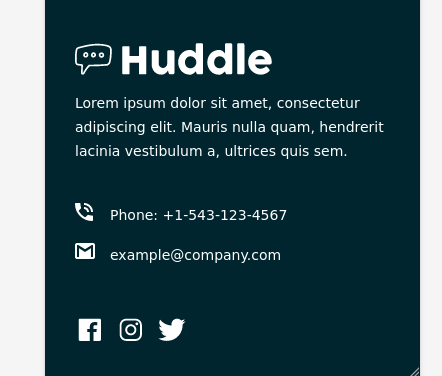
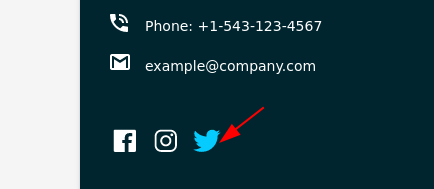
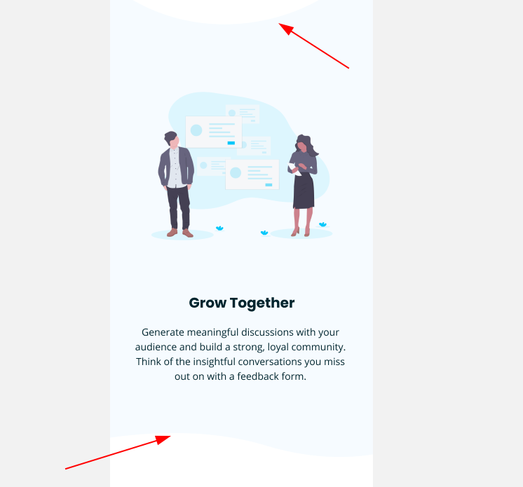

# POST MORTEM

## Social Media Icons (incl. mouseover)



Mouseover: 



```html
<div class="social-box">
  <a href="https://facebook.com"><ion-icon name="logo-facebook"></ion-icon ></a>
  <a href="https://instagram.com"><ion-icon name="logo-instagram"></ion-icon></a>
  <a href="https://twitter.com"><ion-icon name="logo-twitter"></ion-icon></a>
</div>

```

Icons provided by [https://ionic.io/ionicons](https://ionic.io/ionicons). You need to include the following
scripts near the end of your page:

```html
<script type="module" src="https://unpkg.com/ionicons@5.5.2/dist/ionicons/ionicons.esm.js"></script>
<script nomodule src="https://unpkg.com/ionicons@5.5.2/dist/ionicons/ionicons.js"></script>
```

## Background SVGs

No idea how to do those. 



## Email verification


## Takeaways

- Background SVGs
- Better code organisation of CSS code


## Other Solutions

[All Ahmed](https://www.frontendmentor.io/solutions/scss-grid-and-flexbox-layout-SkpHEwIX9)

